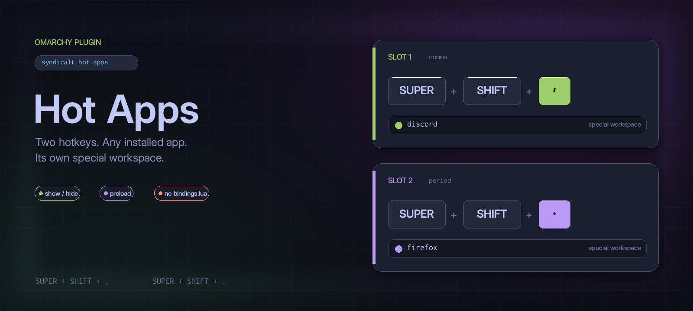

# Omarchy Hot Apps

<p align="center">
  
</p>

Two configurable hotkeys — `SUPER + SHIFT + ,` and `SUPER + SHIFT + .` — that
launch, show, or hide **any installed app** on its own special workspace, with
a config picker.

No more permanently-editing `bindings.lua`: assign whatever app you want to
each slot, from the command line or the GUI picker, and the plugin handles the
toggle, the special workspace, the window rules, and (optionally) preloading.

## Requirements

- Omarchy (uses `omarchy-shell`, `hyprctl`, and the shell's shared app library)
- Chromium/Chrome for web apps and PWAs (only if you want web apps)

## Install

```bash
omarchy plugin add https://github.com/syndicalt/omarchy-hot-apps.git --enable
```

Or by hand: clone this repo to `~/.config/omarchy/plugins/syndicalt.hot-apps/`,
then:

```bash
omarchy-shell shell rescanPlugins
omarchy plugin enable syndicalt.hot-apps
```

## Usage

### Assign an app to a slot

**From the Omarchy menu** (easiest): press `SUPER + SPACE` → **Setup → Hot
Apps** → pick **Slot 1 (,) or Slot 2 (.)**. A searchable picker opens with all
installed apps and icons; click an app to assign it to that slot. The slot row
shows a ✓ when an app is assigned.

The menu entries come from `extensions/omarchy-menu.jsonc` in this repo. Copy
it into `~/.config/omarchy/extensions/omarchy-menu.jsonc`, or merge its
`setup.hotapps*` entries into an existing extension file, and the menu loads
them automatically (the shell hot-reloads menu extensions on save).

**From the terminal:**

```bash
# Assign Discord to the comma slot
omarchy-hot-apps set comma discord

# Search for apps
omarchy-hot-apps apps ""          # full list (or a query like "zoom")

# See both slots
omarchy-hot-apps list

# Remove an assignment
omarchy-hot-apps clear period
```

Or open the picker directly:

```bash
omarchy-shell shell summon syndicalt.hot-apps '{"slot":"comma"}'
```

### Hotkeys

| Key                    | Action                                        |
|------------------------|-----------------------------------------------|
| `SUPER + SHIFT + ,`    | Toggle Slot 1 (comma)                         |
| `SUPER + SHIFT + .`    | Toggle Slot 2 (period)                        |

Each slot's app is shown/hidden on its own special workspace:

- **First use**: launches the app (hidden on its special workspace), learns
  its real window class from Hyprland, and persists it. From then on the
  hotkey reuses that class for instant rule-based placement.
- **Already open**: toggles its special workspace visibility.
- **Open elsewhere**: moves it onto its special workspace, then shows it.

The plugin registers its own Hyprland binds at runtime and re-asserts them
after every config reload (including when a Hyprland config reload re-creates
the static defaults), so it needs no `bindings.lua` edits.

## Configuration

Settings live inline on the plugin's entry in `~/.config/omarchy/shell.json`
(hot-reloads on save). `omarchy-hot-apps set` writes these for you:

```json
{
  "id": "syndicalt.hot-apps",
  "comma": {
    "desktopId": "discord",
    "special": "comma",
    "preload": true,
    "knownClass": "chrome-discord.com__channels_@me-Default"
  },
  "period": {
    "desktopId": "org.mozilla.firefox",
    "special": "period",
    "preload": false
  }
}
```

| Key          | Default       | Meaning                                          |
|--------------|---------------|--------------------------------------------------|
| `desktopId`  | *(unset)*     | The installed app (desktop entry id) for the slot |
| `special`    | the slot      | Special workspace name (must differ between slots)|
| `preload`    | `true`        | Start the app hidden at shell startup             |
| `knownClass` | *(learned)*   | Window class Hyprland reports; set by the plugin  |

### Menu width

The Omarchy menu card is a hardcoded 300px for browse pages, which elides
long app titles on the Hot Apps page. `bin/apply-menu-width` widens that
one page to 420 (idempotent, refuses to patch an unrecognized `Menu.qml`):

```bash
sudo bash ~/.config/omarchy/plugins/syndicalt.hot-apps/bin/apply-menu-width
```

`Menu.qml` is pacman-owned, so **re-run this after every `omarchy` package
update**. The shell hot-reloads QML, so the change applies without a restart.


## Remove

```bash
omarchy plugin remove syndicalt.hot-apps
```

That deletes the plugin directory and its shell.json entry.

## Troubleshooting

```bash
omarchy-hot-apps list                 # slots and their state
omarchy-shell hot-apps state          # internal state (clients, pending)
omarchy-shell hot-apps ping           # is the service alive?
```

If the plugin fails to load, check the shell log:

```bash
tail -n 100 $(ls -t /run/user/$UID/quickshell/by-id/*/log.qslog | head -1)
```
